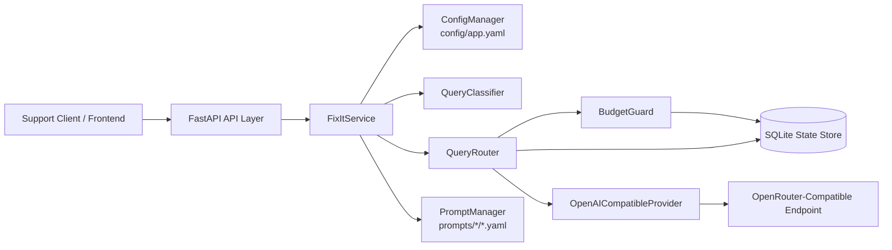

# FixIt AI Support System: Production Architecture & Design

## 1. Objective

Build a local, production-ready LLM system that:

- Handles about `10,000` customer queries per day
- Stays under a `$500/month` model budget
- Targets `>85%` satisfaction through selective use of a stronger model for only the hardest complaint flows
- Supports configuration changes, prompt changes, and routing changes without code edits

## 2. High-Level Architecture



## 3. Local Component Design

### API Layer

- Implemented with `FastAPI`
- Exposes:
  - `POST /query` for routed support responses
  - `GET /health` for health checks
  - `POST /admin/reload` for hot reloading configuration and prompts
  - `GET /admin/stats` for cost and savings snapshots

### Orchestration Layer

- `FixItService` bootstraps config, prompt loading, provider creation, SQLite state, and the router
- Hot reload is controlled by a feature flag and works by re-reading `config/app.yaml` on each request path when enabled

### Classification Layer

- `QueryClassifier` uses external keyword and regex rules from `config/app.yaml`
- Complexity is inferred from:
  - complaint category
  - escalation keywords
  - query length
  - appointment-related keywords

### Routing Layer

- `low` and `medium` complexity both route to the `low` model
- `high` complexity routes to the `high` model
- Complaints default to `high`
- Budget guardrails can downgrade `high` requests to `low`
- Provider failures can fall back from `high -> low`
- If all model spend is blocked, the system returns a safe fallback response

### Prompt Management

- Prompts live outside code in `prompts/<category>/<version>.yaml`
- Each asset stores:
  - `prompt_id`
  - `version`
  - `status`
  - `selection_score`
  - metadata such as owner and baseline satisfaction
- `PromptManager` supports:
  - `latest_stable`
  - `best_performing`

### State and Observability

- SQLite stores:
  - request logs
  - prompt usage counts
  - estimated spend
- This provides a simple local substitute for hosted telemetry and cost dashboards

## 4. Configuration Design

All runtime behavior is externalized in [config/app.yaml](../config/app.yaml):

- `llm`
  - OpenRouter-compatible `base_url`
  - API key environment variable name
  - retry and timeout behavior
  - default headers
- `models`
  - model IDs
  - max output tokens
  - temperature
  - input/output token prices
- `budget`
  - monthly and daily limits
  - warn, degrade, and hard-stop thresholds
- `feature_flags`
  - budget guardrails
  - hot reload
  - request logging
  - model fallbacks
- `classification`
  - per-category keywords and regexes
  - escalation signals
  - complexity thresholds
- `routing`
  - complexity-to-model map
  - fallback order
- `analysis`
  - monthly traffic assumptions
  - route mix assumptions
  - average token assumptions for cost projection

Because everything is file-driven, support ops can change model IDs, pricing, thresholds, or rules without touching Python code.

## 5. Routing Logic

### Primary Rules

| Category | Complexity | Routed Model |
| --- | --- | --- |
| `faq` | `low` | `low` |
| `booking` | `medium` | `low` |
| `complaint` | `high` | `high` |
| `fallback` | `low/medium` | `low` |

### Decision Flow

1. Load latest config if hot reload is enabled.
2. Classify the query into `faq`, `booking`, `complaint`, or `fallback`.
3. Infer complexity.
4. Map complexity to the requested model alias.
5. Check daily and monthly spend.
6. Downgrade `high` traffic when guardrails trigger.
7. Load the active prompt version for that category.
8. Call the OpenRouter-compatible model through the OpenAI SDK.
9. Record prompt usage, request metadata, and estimated spend in SQLite.

## 6. Prompt Versioning Strategy

Prompt assets are versioned as independent YAML files.

Example:

```text
prompts/faq/v1.yaml
prompts/faq/v2.yaml
prompts/complaint/v1.yaml
prompts/complaint/v2.yaml
```

Selection behavior:

- `latest_stable`: choose the highest stable version
- `best_performing`: choose the stable version with the best `selection_score`

This makes prompt rollouts operational rather than code-driven.

## 7. Testing Strategy

The test suite covers the four areas requested:

- Query classification
  - verifies FAQ, booking, and complaint examples
- Configuration loading
  - verifies YAML parsing and environment-variable expansion
- Prompt handling
  - verifies prompt version selection and rendering
- Cost calculation and budget controls
  - verifies token-based pricing and downgrade / hard-stop logic

Tests run with the Python standard library:

```powershell
$env:PYTHONPATH = "src"
python -m unittest discover -s tests -v
```

## 8. Cost Analysis

### Before Optimization

- Current spend assumption from the exercise: `$3,000/month`
- Previous design assumption: every request is sent to a premium model regardless of complexity

### After Optimization

Configuration assumptions in `analysis`:

- `300,000` queries/month
- `85%` low-model traffic
- `15%` high-model traffic
- lower token budgets for low-complexity flows

Projected result from the implementation defaults:

| Metric | Value |
| --- | --- |
| Legacy monthly cost | `$3000.00` |
| Projected monthly cost | about `$261.24` |
| Estimated savings | about `$2738.76` |
| Savings rate | about `91.29%` |

Even after allowing headroom for prompt expansion, retries, and distribution drift, the system stays comfortably under the `$500/month` target.

## 9. Why This Meets the Exercise

- Config-driven architecture: yes
- Intelligent routing with low/high model selection: yes
- Cost enforcement with downgrade and safe fallback: yes
- Prompt versioning and external storage: yes
- Automated tests: yes
- Local services instead of AWS: yes
- OpenAI SDK with OpenRouter-compatible endpoint design: yes
